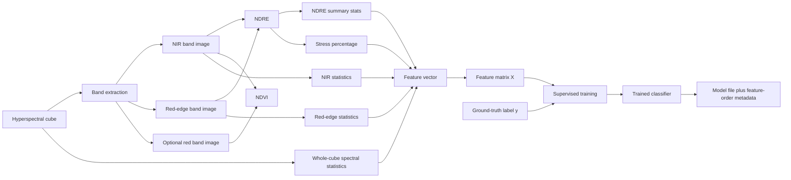
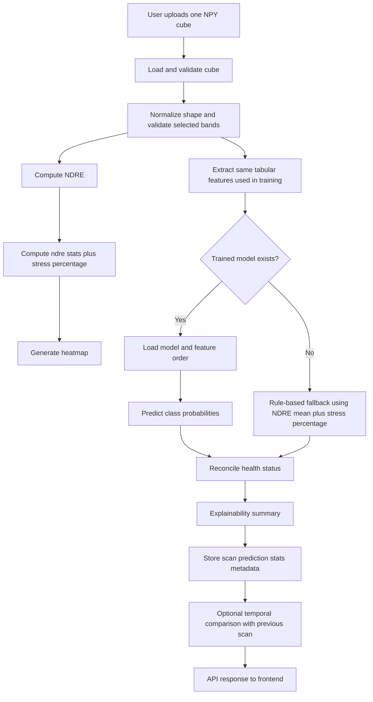

# Hyperspectral Model Workflow

This project has two different flows:

1. Training flow: many labeled hyperspectral cubes -> trained model artifacts
2. Upload/inference flow: one uploaded cube -> prediction + heatmap + stored scan record

The main training code is in [train_model.py](/Users/shubhamsahoo/Desktop/hidden-hunger/train_model.py), [prepare_dataset.py](/Users/shubhamsahoo/Desktop/hidden-hunger/prepare_dataset.py), and [app/services/inference.py](/Users/shubhamsahoo/Desktop/hidden-hunger/app/services/inference.py).

## 1. Training Workflow Diagram

```mermaid
flowchart TD
    A[Input: labeled hyperspectral NPY cubes] --> B[Data ingestion]
    B --> B1[Option A: folder by class]
    B --> B2[Option B: CSV manifest plus NPY directory]
    B1 --> C[Load NPY cube]
    B2 --> C
    C --> D[Normalize cube shape to bands x height x width]
    D --> E[Select spectral bands]
    E --> E1[NIR band]
    E --> E2[Red-edge band]
    E --> E3[Optional red band]
    E1 --> F[Feature extraction]
    E2 --> F
    E3 --> F
    F --> F1[NDRE = (NIR - RedEdge) / (NIR + RedEdge)]
    F --> F2[Optional NDVI = (NIR - Red) / (NIR + Red)]
    F --> F3[NDRE stats: min max mean std p10 p50 p90]
    F --> F4[Stress percentage = pixels with NDRE below threshold]
    F --> F5[Band summaries: mean std percentiles]
    F --> F6[Spectral slope features]
    F --> F7[Low mid high spectral region features]
    F --> F8[Cube-level intensity stats]
    F --> F9[Red-edge and NIR relation features]
    F --> G[Tabular feature row per cube]
    G --> H[Training feature table CSV]
    H --> I[Load numeric columns only]
    I --> J[Impute missing values with per-column median]
    J --> K[Prepare labels]
    K --> K1[Use class labels directly]
    K --> K2[Or bin numeric stress labels into 4 classes]
    K1 --> L[Train test split]
    K2 --> L
    L --> M{search_best?}
    M -->|No| N[Train RandomForestClassifier]
    M -->|Yes| O[5-fold CV model search]
    O --> O1[RandomForest]
    O --> O2[ExtraTrees]
    O --> O3[HistGradientBoosting]
    O --> O4[Soft Voting ensemble]
    O1 --> P[Pick best CV model]
    O2 --> P
    O3 --> P
    O4 --> P
    N --> Q[Fit final classifier]
    P --> Q
    Q --> R[Evaluate on test split]
    R --> R1[Accuracy]
    R --> R2[Classification report]
    R --> R3[Confusion matrix]
    Q --> S[Save artifacts]
    S --> S1[models_store/stress_model.pkl]
    S --> S2[models_store/feature_columns.json]
```

## 2. Training Data Flow



## 3. Algorithms Used In Between

- NPY loading and cube shape normalization
  - Accepts both `(bands, height, width)` and `(height, width, bands)`
- Band-based vegetation indices
  - NDRE
  - Optional NDVI
- Statistical feature engineering
  - min, max, mean, std
  - p10, p50, p90 percentiles
  - stress percentage
  - per-band mean/std summaries
  - spectral slope summaries
  - low/mid/high spectral region ratios
  - cube-level intensity stats
  - red-edge and NIR relation features
- Data cleaning
  - keep numeric columns
  - median imputation for NaN values
- Label engineering
  - direct multiclass labels, or
  - numeric stress labels mapped to 4 classes:
    - `0-15 -> healthy`
    - `16-40 -> nutrient_like_stress`
    - `41-75 -> drought_like_stress`
    - `76-100 -> disease_like_stress`
- Model training
  - default: `RandomForestClassifier`
  - optional search-best candidates:
    - `RandomForestClassifier`
    - `ExtraTreesClassifier`
    - `HistGradientBoostingClassifier`
    - soft `VotingClassifier`
- Model selection and evaluation
  - train/test split
  - stratified split when possible
  - 5-fold cross-validation during model search
  - accuracy, classification report, confusion matrix
- Artifact saving
  - serialized model
  - feature column order and label metadata for inference compatibility

## 4. What Exactly Is The Training Input?

The training input is not a single uploaded cube.

It is:

- many hyperspectral `.npy` cubes
- plus a label for each cube
- plus band choices such as `nir_band`, `red_edge_band`, and optionally `red_band`

The labels can come from:

- folder names like `healthy/`, `drought_stress/`, etc.
- or a manifest CSV with file path + label

## 5. What Exactly Is The Training Output?

The training output is not the final prediction JSON.

It is the saved model artifacts:

- `models_store/stress_model.pkl`
- `models_store/feature_columns.json`

Those artifacts are later loaded by the API during prediction.

## 6. Upload / Inference Workflow Diagram

This is the runtime path when the frontend uploads one cube to the backend.



## 7. Code References

- Dataset preparation and feature extraction:
  - [prepare_dataset.py](/Users/shubhamsahoo/Desktop/hidden-hunger/prepare_dataset.py)
- Training and model search:
  - [train_model.py](/Users/shubhamsahoo/Desktop/hidden-hunger/train_model.py)
- Inference-time feature extraction and model loading:
  - [app/services/inference.py](/Users/shubhamsahoo/Desktop/hidden-hunger/app/services/inference.py)
- Upload endpoint orchestration:
  - [app/routers/upload.py](/Users/shubhamsahoo/Desktop/hidden-hunger/app/routers/upload.py)
